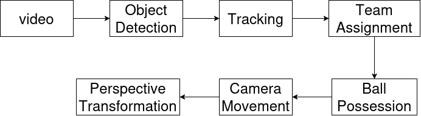

# football_analysis

## 1. Overview

This project is a **computer vision-based football analysis system** that extracts player, ball, and team information from football videos.

The main goal is to analyze **player movements, team assignments, and ball possession** using object detection, tracking, and spatial analysis.

Technologies: Python, YOLOv8, ByteTrack, OpenCV, K-Means, Optical Flow, and Perspective Transformation.

!(demo)[readme_assets/demo.gif]

## 2. Pipeline

## 3. Object Detection Model Training

I trained a **YOLOv8** object detection model to detect three classes:

- Player
- Referee
- Ball

The dataset was obtained from the [Roboflow Football Players Detection dataset](https://universe.roboflow.com/roboflow-jvuqo/football-players-detection-3zvbc/dataset/1)

The complete training process, including dataset preparation and YOLOv8 training, is available in my [Google Colab notebook](https://colab.research.google.com/drive/1USEC4FLnAVmLlfM4LcC2HAlVrM5WxOcS?usp=sharing)

## 4. Object Tracking
